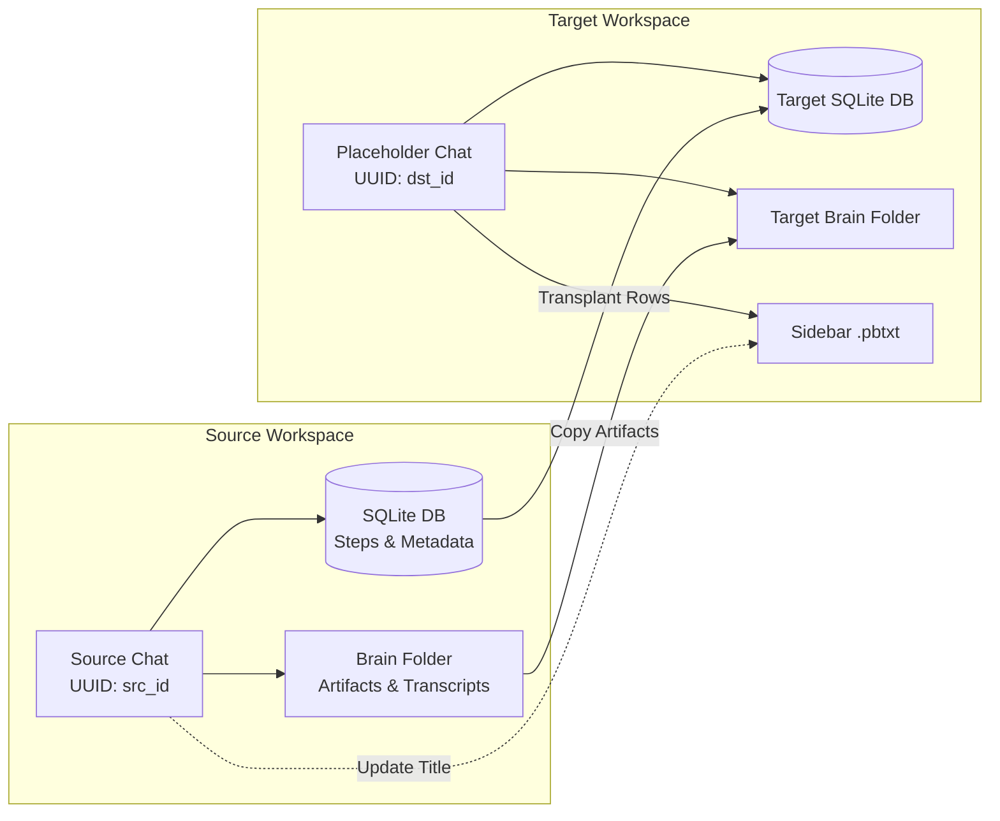

# Antigravity Move Chat to Projects (Universal Conversation Transplanter)

[](https://github.com/Jabir-A-H/antigravity-move-chat-to-projects/releases)
[](LICENSE)
[](https://www.python.org/)
[]()
[]()

A lightweight, zero-dependency CLI utility to move, migrate, and transplant conversations, agent trajectory history, execution metadata, artifacts, and plans between projects/workspaces in **Google Antigravity**.

> 📦 **Quick Download:** Download [`transplant_chat.py`](https://raw.githubusercontent.com/Jabir-A-H/antigravity-move-chat-to-projects/main/transplant_chat.py) directly (Right-click → *Save link as...*) or grab the script from the [Latest Release](https://github.com/Jabir-A-H/antigravity-move-chat-to-projects/releases/latest).

---

## 🎯 The Problem

You fire up Antigravity and start brainstorming or generating ideas for something new. The agent produces solid plans, code snippets, and architecture... but then you realize: **the chat was either in no-workspace mode, or accidentally started inside a completely different project.**

Up until now, you were stuck with two equally frustrating options:
1. **Rerun the prompt** in the new project and hope the agent doesn't hallucinate or drift.
2. **Manually copy-paste** all markdown plans, task lists, code chunks, and context across files.

Currently, Antigravity has no built-in **"Move Chat to Workspace"** or **"Export/Import"** button. If you try to manually copy `.db` files from `~/.gemini/antigravity/conversations`, it breaks because conversations are cryptographically bound to specific workspace hashes and compiled Protobuf headers.

## 💡 The Solution

**`transplant_chat.py`** safely transplants the conversation:
1. **No Setup Needed:** Runs directly with standard Python standard libraries—no `pip install` or extra packages required.
2. **Transfers Full Context & Plans:** Moves over every message, tool action, and generated file (`implementation_plan.md`, `walkthrough.md`, `task.md`) so the AI remembers everything without missing a beat.
3. **Preserves Native Workspace Bindings:** Keeps the destination workspace's valid Protobuf headers, hashes, and session tokens so Antigravity doesn't crash or discard the chat.
4. **Synchronizes Sidebar Title:** Automatically updates `.pbtxt` metadata so the chat appears with its proper title in the Antigravity sidebar.
5. **Auto-Backups for Safety:** Creates automatic timestamped backups of both the target database and the target brain directory before touching anything.

---

## 🔄 How It Works



---

## 🚀 Quick Start (3 Simple Steps)

### Step 1: Create an Empty Placeholder Chat
1. Open Antigravity and navigate to your **target project/workspace**.
2. Start a new chat, send a 1-word message (like `hi`), and wait for the agent to reply.
   *(This initializes the target database and native workspace bindings).*

> [!TIP]
> **Safety First — Note Down Your IDs:**
> It is always recommended to note down your source and target chat titles/IDs in a notepad before closing. While the `--list` command below makes it easy to find them, having them written down ensures you double-check and transplant into the right conversation!

### Step 2: Close Antigravity Completely
Shut down Google Antigravity so SQLite database locks are released.

### Step 3: Run the CLI Tool

#### A. Find Your Conversation IDs (Optional)
Run the built-in `--list` command to see your recent conversations:

```bash
python transplant_chat.py --list
```

Output:
```text
=====================================================================================
 Recent Antigravity Conversations (Top 15)
=====================================================================================
Last Modified        | Conversation ID (UUID)                 | Title
-------------------------------------------------------------------------------------
2026-09-08 00:30:15  | 21e82bc8-****-****-****-************  | hi
2026-09-08 00:15:42  | 7b7c0bee-****-****-****-************  | Refactor Auth & Database
...
=====================================================================================
```
- **Source UUID**: The chat you want to move (e.g. `7b7c0bee-****-****-****-************`).
- **Target UUID**: The placeholder chat you just created (e.g. `21e82bc8-****-****-****-************`).

#### B. Run the Transplant

```bash
python transplant_chat.py <SOURCE_UUID> <DEST_UUID>
```

Example (with optional custom sidebar title):
```bash
python transplant_chat.py 7b7c0bee-****-****-****-************ 21e82bc8-****-****-****-************ "My New Feature Plan"
```

### Step 4: Reopen Antigravity
Launch Antigravity and open your target project. Your complete conversation, steps, planning artifacts, and history will be waiting for you!

---

## ⚙️ Command-Line Reference

```text
usage: transplant_chat.py [-h] [-l] [--limit LIMIT] [src] [dst] [title]

Transplant any Antigravity conversation into another workspace.

positional arguments:
  src            Source conversation UUID (the chat you want to move)
  dst            Destination conversation UUID (the placeholder chat in target workspace)
  title          Optional title to display in sidebar (defaults to source conversation title)

options:
  -h, --help     show this help message and exit
  -l, --list     List recent conversations with UUIDs, titles, and timestamps
  --limit LIMIT  Maximum conversations to display with --list (default: 15)
```

---

## 🛡️ Safety & Rollback

Before any modification, `transplant_chat.py` creates automatic timestamped safety backups:
- **Database Backup**: `~/.gemini/antigravity/conversations/<DST_ID>.db.backup_<TIMESTAMP>`
- **Brain Backup**: `~/.gemini/antigravity/brain/<DST_ID>_backup_<TIMESTAMP>`

### Restoring from Backup
If you ever want to revert the destination chat:
1. Close Antigravity.
2. Locate the backup file in `~/.gemini/antigravity/conversations/`.
3. Rename or copy `<DST_ID>.db.backup_<TIMESTAMP>` back to `<DST_ID>.db`.
4. (Optional) Restore the brain directory from `<DST_ID>_backup_<TIMESTAMP>` to `<DST_ID>`.

---

## 📂 Antigravity Data Architecture Reference

For reference, Antigravity stores conversation state inside your user profile under `~/.gemini/antigravity/`:

| Directory | Purpose | What `transplant_chat.py` does |
| :--- | :--- | :--- |
| `conversations/<id>.db` | SQLite database storing conversation steps and metadata | Replaces rows in `steps`, `gen_metadata`, `executor_metadata`, `parent_references`, `battle_mode_infos` |
| `brain/<id>/` | Markdown artifacts (`implementation_plan.md`, `walkthrough.md`), scratch scripts, and JSONL transcripts | Copies entire brain folder contents into target |
| `annotations/<id>.pbtxt` | Protobuf text file storing conversation title and view timestamps | Updates `title:"..."` to match source or custom title |

---

## 💻 Compatibility

- **OS**: Windows, macOS, Linux
- **Python**: 3.8 or higher
- **Dependencies**: None (uses standard Python library: `sqlite3`, `shutil`, `re`, `argparse`, `os`, `sys`)

---

## 🤝 Contributing

Contributions, bug reports, and feature requests are welcome! Feel free to open an issue or submit a Pull Request.

## 📄 License

This project is licensed under the [MIT License](LICENSE).
