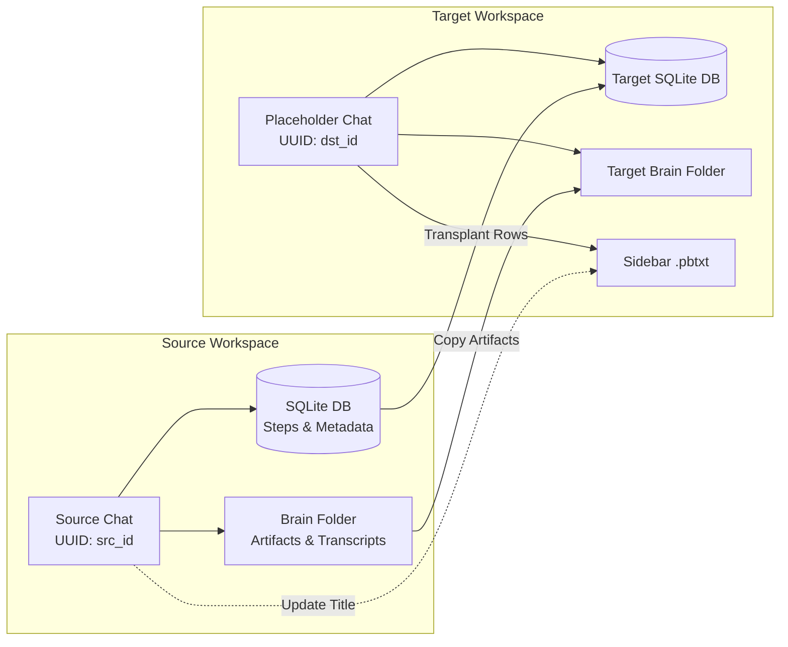

# Antigravity Move Chat to Projects (Universal Conversation Transplanter)

[](LICENSE)
[](https://www.python.org/)
[]()
[]()

A lightweight, zero-dependency CLI utility to transplant conversations, agent trajectory history, execution metadata, artifacts, and plans between projects/workspaces in **Google Antigravity**.

---

## 🎯 The Problem

In Google Antigravity, conversations are cryptographically bound to specific workspace paths, internal hashes, and Protobuf bindings at creation time.

If you start an exploratory chat (or brainstorm in a temporary workspace) and later realize:
- *"I need this entire conversation history inside my actual project workspace."*
- *"I want the agent to retain all trajectory steps, file modifications, and planning context."*
- *"I want the generated artifacts (`implementation_plan.md`, `walkthrough.md`, `task.md`) and subagent transcripts preserved."*

Currently, Antigravity has no built-in **"Move Chat to Workspace"** button. Copying raw databases directly breaks Protobuf workspace bindings.

## 💡 The Solution

**`transplant_chat.py`** safely transplants the conversation:
1. **Preserves Workspace Bindings**: Retains the target workspace's native Protobuf hashes and workspace mapping.
2. **Transfers Trajectory History**: Copies SQLite trajectory tables (`steps`, `gen_metadata`, `executor_metadata`, `parent_references`, `battle_mode_infos`).
3. **Migrates Agent Brain & Artifacts**: Copies all plans, walkthroughs, artifacts, and JSONL transcripts into the target brain folder.
4. **Synchronizes Sidebar Title**: Updates the `.pbtxt` metadata so the chat appears with its proper title in the Antigravity sidebar.
5. **Zero Data Loss / Automatic Backups**: Automatically creates timestamped backups of both the target database and the target brain directory before modifying anything.

---

## 🔄 How It Works



---

## 🚀 Quick Start

### Step 1: Fully Close Antigravity
Ensure Google Antigravity is completely shut down so SQLite database locks are released.

### Step 2: Create a Target Placeholder Chat
1. Open Antigravity and navigate to your **target project/workspace**.
2. Start a new chat, send a single short message (e.g. `hi`), and wait for the agent to reply.
   *(This initializes the target database and workspace bindings).*
3. Close Antigravity again.

> [!TIP]
> **Safety First — Note Down Your IDs:**
> It is always recommended to note down your source and target chat titles/IDs in a notepad before closing. While the `--list` command below makes it easy to find them, having them written down ensures you double-check and transplant into the right conversation!

### Step 3: Find Your Conversation IDs
Run the built-in `--list` command to see your recent conversations:

```bash
python transplant_chat.py --list
```

Output:
```text
=====================================================================================
 Recent Antigravity Conversations (Top 15)
=====================================================================================
Last Modified        | Conversation ID (UUID)                 | Title
-------------------------------------------------------------------------------------
2026-09-08 00:30:15  | 21e82bc8-****-****-****-************  | hi
2026-09-08 00:15:42  | 7b7c0bee-****-****-****-************  | Refactor Auth & Database
...
=====================================================================================
```
- **Source UUID**: The chat you want to move (e.g. `7b7c0bee-****-****-****-************`).
- **Target UUID**: The placeholder chat you just created (e.g. `21e82bc8-****-****-****-************`).

### Step 4: Run the Transplant Command

```bash
python transplant_chat.py <SRC_ID> <DST_ID>
```

Example:
```bash
python transplant_chat.py 7b7c0bee-****-****-****-************ 21e82bc8-****-****-****-************ "My New Feature Plan"
```

### Step 5: Reopen Antigravity
Launch Antigravity and open your target project. Your complete conversation, steps, planning artifacts, and history will be waiting for you!

---

## ⚙️ Command-Line Reference

```text
usage: transplant_chat.py [-h] [-l] [--limit LIMIT] [src] [dst] [title]

Transplant any Antigravity conversation into another workspace.

positional arguments:
  src            Source conversation UUID (the chat you want to move)
  dst            Destination conversation UUID (the placeholder chat in target workspace)
  title          Optional title to display in sidebar (defaults to source conversation title)

options:
  -h, --help     show this help message and exit
  -l, --list     List recent conversations with UUIDs, titles, and timestamps
  --limit LIMIT  Maximum conversations to display with --list (default: 15)
```

---

## 🛡️ Safety & Rollback

Before any modification, `transplant_chat.py` creates automatic timestamped safety backups:
- **Database Backup**: `~/.gemini/antigravity/conversations/<DST_ID>.db.backup_<TIMESTAMP>`
- **Brain Backup**: `~/.gemini/antigravity/brain/<DST_ID>_backup_<TIMESTAMP>`

### Restoring from Backup
If you ever want to revert the destination chat:
1. Close Antigravity.
2. Locate the backup file in `~/.gemini/antigravity/conversations/`.
3. Rename or copy `<DST_ID>.db.backup_<TIMESTAMP>` back to `<DST_ID>.db`.
4. (Optional) Restore the brain directory from `<DST_ID>_backup_<TIMESTAMP>` to `<DST_ID>`.

---

## 📂 Antigravity Data Architecture Reference

For reference, Antigravity stores conversation state inside your user profile under `~/.gemini/antigravity/`:

| Directory | Purpose | What `transplant_chat.py` does |
| :--- | :--- | :--- |
| `conversations/<id>.db` | SQLite database storing conversation steps and metadata | Replaces rows in `steps`, `gen_metadata`, `executor_metadata`, `parent_references`, `battle_mode_infos` |
| `brain/<id>/` | Markdown artifacts (`implementation_plan.md`, `walkthrough.md`), scratch scripts, and JSONL transcripts | Copies entire brain folder contents into target |
| `annotations/<id>.pbtxt` | Protobuf text file storing conversation title and view timestamps | Updates `title:"..."` to match source or custom title |

---

## 💻 Compatibility

- **OS**: Windows, macOS, Linux
- **Python**: 3.8 or higher
- **Dependencies**: None (uses standard Python library: `sqlite3`, `shutil`, `re`, `argparse`, `os`, `sys`)

---

## 🤝 Contributing

Contributions, bug reports, and feature requests are welcome! Feel free to open an issue or submit a Pull Request.

## 📄 License

This project is licensed under the [MIT License](LICENSE).
