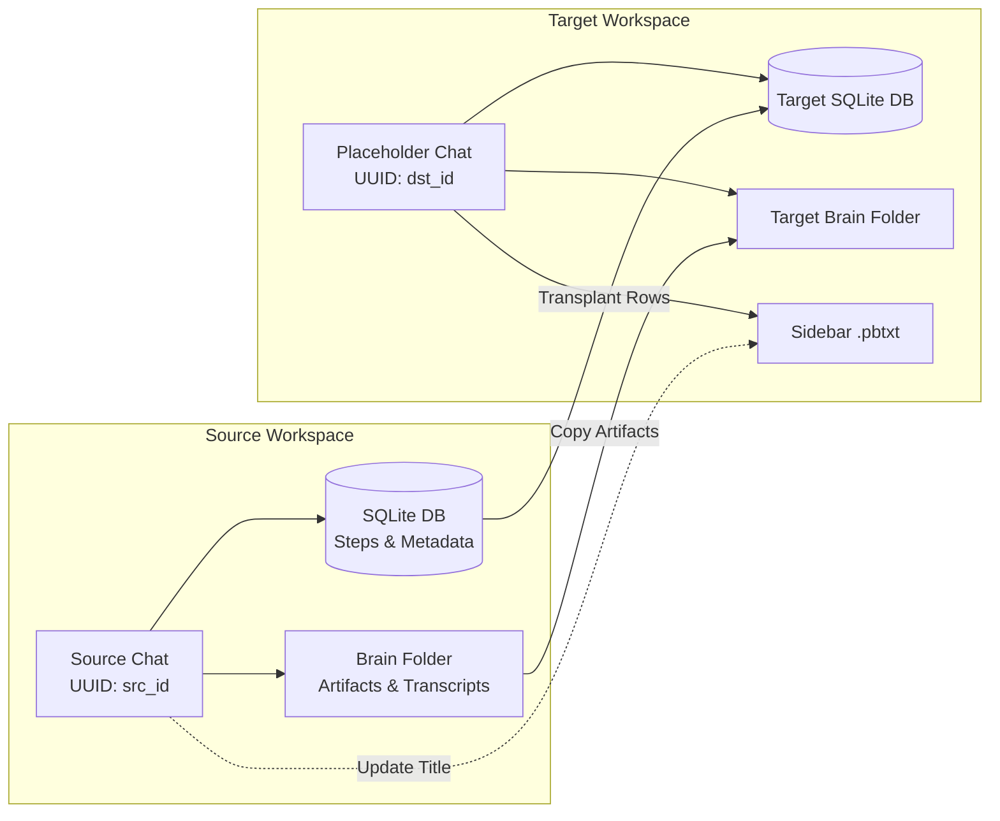
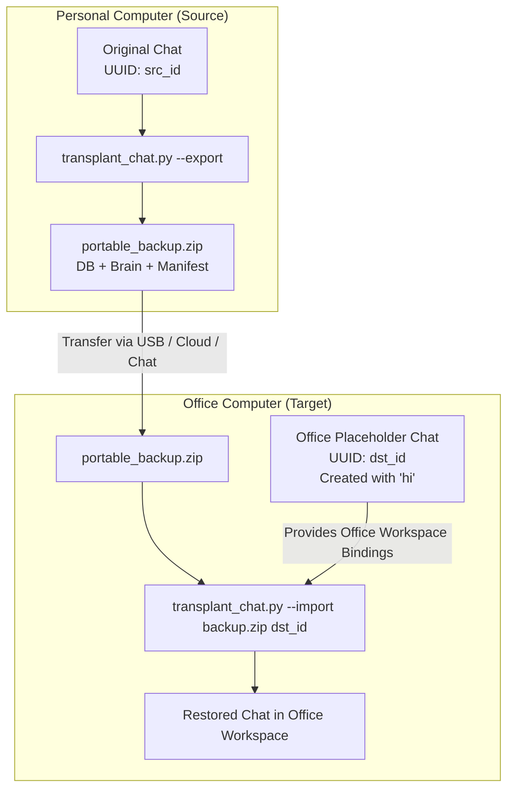

# Antigravity Move Chat to Projects (Universal Conversation Transplanter & Backup)

[](https://github.com/Jabir-A-H/antigravity-move-chat-to-projects/releases)
[](LICENSE)
[](https://www.python.org/)
[]()
[]()

A lightweight, zero-dependency CLI utility to move, migrate, backup, export, and transplant conversations, agent trajectory history, execution metadata, artifacts, and plans between projects/workspaces in **Google Antigravity**—either on the same machine or across different computers (e.g. Personal PC to Office PC).

> 📦 **Quick Download:** Download [`transplant_chat.py`](https://raw.githubusercontent.com/Jabir-A-H/antigravity-move-chat-to-projects/main/transplant_chat.py) directly (Right-click → *Save link as...*) or grab the script from the [Latest Release](https://github.com/Jabir-A-H/antigravity-move-chat-to-projects/releases/latest).

---

## 🎯 The Problem

You fire up Antigravity and start brainstorming or generating ideas for something new. The agent produces solid plans, code snippets, and architecture... but then you realize:
1. **The chat was started in no-workspace mode, or inside a completely different project.**
2. **You need to switch devices** (e.g. from your home/personal PC to your office workstation) and want to bring your full conversation and planning state with you.

Up until now, you were stuck with frustrating workarounds:
1. **Rerunning the prompt** in the new project and hoping the agent doesn't hallucinate or drift.
2. **Manually copy-pasting** markdown plans, task lists, code chunks, and context across files.
3. **Copying `.db` files directly**, which breaks because conversations are cryptographically bound to specific local workspace hashes and compiled Protobuf headers.

Currently, Antigravity has no built-in **"Move Chat to Workspace"** or **"Export/Import"** button.

---

## 💡 The Solution

**`transplant_chat.py`** provides a complete migration and backup toolkit:
1. **Zero External Dependencies:** Runs directly with standard Python 3.8+ (`sqlite3`, `zipfile`, `shutil`, `re`, `json`, `argparse`)—no `pip install` or extra packages needed.
2. **Move Chats Locally:** Move conversations between workspaces on the same computer with a single command.
3. **Export & Import Across Devices (.zip):** Package an entire conversation into a standalone, compressed `.zip` backup archive. Take just that `.zip` file to your office computer, and import it into any chat.
4. **Preserves Native Workspace Bindings:** Keeps the destination workspace's valid Protobuf headers, hashes, and session tokens so Antigravity doesn't crash or discard the chat.
5. **Transfers Full Context & Plans:** Restores every message, tool action, and generated artifact (`implementation_plan.md`, `walkthrough.md`, `task.md`, transcript logs) so the AI remembers everything.
6. **Synchronizes Sidebar Title:** Automatically updates `.pbtxt` metadata so the chat appears with its proper title in the Antigravity sidebar.
7. **Auto-Backups for Safety:** Creates automatic timestamped backups of both the target database and target brain directory before modifying anything.

---

## 🔄 How It Works

### Scenario A: Same Computer (Direct Workspace Transplant)


### Scenario B: Across Devices (Portable .zip Export & Import)


---

## 🚀 Quick Start Guide

### 1. Moving a Chat on the Same Computer

#### Step 1: Create an Empty Placeholder Chat
1. In Antigravity, open your **target project/workspace**.
2. Start a new chat, send a 1-word message (like `hi`), and wait for the agent to reply.
   *(This initializes the target database and native workspace bindings).*

> [!TIP]
> **Safety First — Note Down Your IDs:**
> It is always recommended to note down your source and target chat titles/IDs in a notepad before closing. Run `python transplant_chat.py --list` to view your recent chat IDs.

#### Step 2: Close Antigravity Completely
Shut down Google Antigravity so SQLite database locks are released.

#### Step 3: Run the Transplant Command
```bash
python transplant_chat.py <SOURCE_UUID> <DEST_UUID> ["Optional Custom Title"]
```

---

### 2. Moving Across Devices (e.g. Personal PC $\rightarrow$ Office PC)

#### Step 1: On Your Personal Computer (Export to .zip)
1. Run `--list` to find your conversation UUID:
   ```bash
   python transplant_chat.py --list
   ```
2. Export the chat to a portable `.zip` backup:
   ```bash
   # Auto-names archive based on chat title and timestamp:
   python transplant_chat.py --export <SOURCE_UUID>

   # Or specify a custom output path:
   python transplant_chat.py --export <SOURCE_UUID> my_chat_backup.zip
   ```
3. Transfer only `my_chat_backup.zip` to your office computer (via USB drive, cloud storage, Slack, or email).

#### Step 2: On Your Office Computer (Import from .zip)
1. Open Antigravity in your desired office workspace.
2. Start a new chat, send a 1-word message (like `hi`), and wait for the reply.
3. Close Antigravity completely.
4. Run `--list` on your office computer to find the placeholder chat UUID:
   ```bash
   python transplant_chat.py --list
   ```
5. Import the `.zip` backup into the placeholder chat:
   ```bash
   python transplant_chat.py --import my_chat_backup.zip <OFFICE_CHAT_UUID>

   # Or specify a custom sidebar title:
   python transplant_chat.py --import my_chat_backup.zip <OFFICE_CHAT_UUID> "Refactored Feature"
   ```
6. Reopen Antigravity: your complete conversation history, plans, tool actions, and sidebar title are ready in your office workspace!

---

## 🔍 Inspecting an Archive

You can inspect the contents and metadata of an exported chat archive without extracting it:

```bash
python transplant_chat.py --info my_chat_backup.zip
# or simply:
python transplant_chat.py my_chat_backup.zip
```

Output:
```text
=================================================================
 Antigravity Chat Archive Info
=================================================================
 Archive File   : my_chat_backup.zip (0.07 MB)
 Chat Title     : Refactor Auth & Database
 Original UUID  : 7b7c0bee-****-****-****-************
 Exported At    : 2026-09-10 14:16:53
 Total Steps    : 42
 Brain Files    : 8 artifacts & logs
=================================================================
```

---

## ⚙️ Command-Line Reference

```text
usage: transplant_chat.py [-h] [-l] [--limit LIMIT]
                          [-e SRC_ID [OUTPUT_ZIP ...]]
                          [-i ARCHIVE [DST_ID ...]]
                          [--info ARCHIVE_ZIP]
                          [pos_args ...]

Antigravity Universal Conversation Transplanter & Backup Utility

positional arguments:
  pos_args              Positional arguments for transplant, export, or import shortcuts

options:
  -h, --help            Show this help message and exit
  -l, --list            List recent conversations with UUIDs, titles, and timestamps
  --limit LIMIT         Maximum conversations to display with --list (default: 15)
  -e, --export          Export conversation to a portable .zip backup file
  -i, --import          Import .zip backup into target placeholder chat
  --info ARCHIVE_ZIP    Inspect a .zip chat backup without extracting
```

### Quick Syntax Examples

| Task | Command |
| :--- | :--- |
| **List recent chats** | `python transplant_chat.py --list` |
| **Export chat to zip** | `python transplant_chat.py --export <SRC_ID> [output.zip]` |
| **Inspect zip archive** | `python transplant_chat.py --info <archive.zip>` |
| **Import zip into chat** | `python transplant_chat.py --import <archive.zip> <DST_ID> ["Title"]` |
| **Import shortcut** | `python transplant_chat.py <archive.zip> <DST_ID> ["Title"]` |
| **Direct local transplant**| `python transplant_chat.py <SRC_ID> <DST_ID> ["Title"]` |

---

## 🛡️ Safety & Rollback

Before any modification or import, `transplant_chat.py` automatically creates timestamped safety backups of the target chat:
- **Database Backup**: `~/.gemini/antigravity/conversations/<DST_ID>.db.backup_<TIMESTAMP>`
- **Brain Backup**: `~/.gemini/antigravity/brain/<DST_ID>_backup_<TIMESTAMP>`

### Restoring from Backup
If you ever want to revert the destination chat:
1. Close Antigravity.
2. Locate the backup in `~/.gemini/antigravity/conversations/`.
3. Copy `<DST_ID>.db.backup_<TIMESTAMP>` back to `<DST_ID>.db`.
4. (Optional) Restore the brain directory from `<DST_ID>_backup_<TIMESTAMP>` to `<DST_ID>`.

---

## 📂 Antigravity Data Architecture Reference

For reference, Antigravity stores conversation state inside your user profile under `~/.gemini/antigravity/`:

| Directory / File | Purpose | What `transplant_chat.py` Does |
| :--- | :--- | :--- |
| `conversations/<id>.db` | SQLite database storing conversation steps and metadata | Replaces rows in `steps`, `gen_metadata`, `executor_metadata`, `parent_references`, `battle_mode_infos` while preserving workspace `trajectory_meta` & `trajectory_metadata_blob` |
| `brain/<id>/` | Markdown artifacts (`implementation_plan.md`, `walkthrough.md`), scratch scripts, and JSONL transcripts | Copies entire brain folder contents into target |
| `annotations/<id>.pbtxt` | Protobuf text file storing conversation title and view timestamps | Updates `title:"..."` to match source, archive manifest, or custom title |
| `exported_chat.zip` | Portable archive generated by `--export` | Contains `manifest.json`, `conversation.db`, `brain/` folder, and `annotations.pbtxt` |

---

## 💻 Compatibility

- **OS**: Windows, macOS, Linux
- **Python**: 3.8 or higher
- **Dependencies**: None (uses standard Python library: `sqlite3`, `zipfile`, `tempfile`, `json`, `shutil`, `re`, `argparse`, `os`, `sys`)

---

## 🤝 Contributing

Contributions, bug reports, and feature requests are welcome! Feel free to open an issue or submit a Pull Request.

## 📄 License

This project is licensed under the [MIT License](LICENSE).
